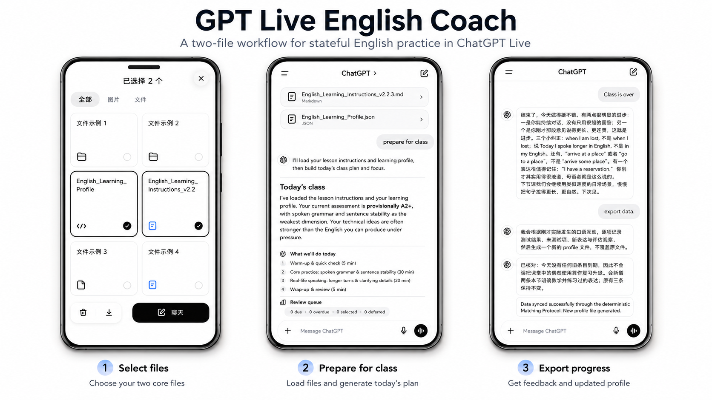
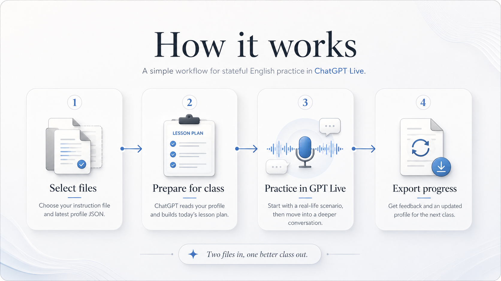

# GPT Live English Coach

  <a href="README.md">English</a> ·
  <a href="README.zh-CN.md">简体中文</a>

  
  
  
  
  

<h3 align="center">The English course GPT‑Live was made for.</h3>

  <strong>An open-source AI English tutor for ChatGPT Voice.</strong> 
  Attach two files. Step into Live. Practice everyday English, get corrected in the moment, debate fresh real-world topics, and leave with a learner profile that remembers what comes next.

  Full-duplex speaking · Web-grounded topics · Live correction · Spaced review · No app to install

  

## Voice just became a real learning surface

OpenAI says **more than 150 million people** use features such as Voice and Dictation every week. GPT‑Live brings full-duplex conversation, better listening through pauses, natural interruption, and background delegation for search and deeper reasoning. The result is a voice interface that can finally carry the rhythm, pressure, and spontaneity of serious speaking practice. [Read the GPT‑Live announcement](https://openai.com/index/introducing-gpt-live/).

**GPT Live English Coach gives that new interface a curriculum, a memory, and a teacher's personality.**

- **Start in real life.** Warm up through hotels, cafés, travel, small talk, clarification, and everyday social situations.
- **Feel the correction.** The coach catches awkward phrasing, Chinglish, register, pragmatics, and reusable lexical chunks while the conversation is still alive.
- **Open into the world.** Every lesson can grow into a fresh, web-grounded topic and a deeper debate.
- **Carry progress forward.** A portable JSON profile preserves your blind spots, review items, session history, and next steps.

## Why GPT‑Live changes the lesson

Earlier voice tutors usually rebuild the same pipeline: speech-to-text, an LLM response, then text-to-speech. GPT‑Live runs continuous interaction inside ChatGPT Voice, so the learner can pause, interrupt, think aloud, and stay inside one flowing conversation. It can also draw on web search, memory, text, images, and visual results in the same chat. That gives this instruction a much richer surface than a traditional voice prompt or a standalone English-tutor demo.

## What you actually use

You only need two files:

1. `English_Learning_Instructions.md`
2. your latest `English_Learning_Profile.json`

That is the whole user-facing workflow.

## How it works

  

## Quick start

### First class

1. Download `English_Learning_Instructions.md`.
2. Start a new ChatGPT conversation.
3. Attach the instruction file.
4. Send: `Start my first class.`
5. Follow the setup and placement flow.
6. After class, return to text and send: `Test finished`.
7. Download the generated `English_Learning_Profile.json`.

> No learner profile is needed for your first class. ChatGPT creates your personal profile after the placement session.

### Every class after that

1. Start a new ChatGPT conversation.
2. Attach:
   - `English_Learning_Instructions.md`
   - your latest `English_Learning_Profile.json`
3. Send: `Prepare for class`.
4. Read the pre-flight briefing.
5. Enter GPT Live and speak.
6. When you finish, return to text and send: `Class is over, export data.`
7. Download the updated profile JSON and keep it for the next lesson.

## What a lesson feels like

### The opening

You attach your two files, say `Prepare for class`, and receive a pre-flight briefing that sets the tone for the whole lesson.

### The class itself

The lesson opens with an everyday speaking scene, builds momentum through guided practice, and then opens into a fresher, wider conversation.

### The finish

You get a concise wrap-up, a sync pass over the lesson, and an updated profile file with the new state of your learning.

## Example interaction

**Learner:** I very agree with that, because—

**Coach:** Tiny fix: **I completely agree with that.** Say that once.

**Learner:** I completely agree with that.

**Coach:** Exactly. Now—what makes you so sure?

---

**Learner:** I felt I was abandoned by the team after I did most of the work.

**Coach:** That sounds genuinely painful, especially if you had been carrying the project. Here, **I felt let down by the team** is probably the more natural fit; **abandoned** sounds stronger and more absolute. Which hurt more—the lack of help or the lack of recognition?

## Repository contents

- `English_Learning_Instructions.md` — the main instruction file (current release: **v2.2.3**)
- `assets/hero-collage.png` — README hero image
- `assets/how-it-works.png` — README workflow poster
- `assets/social-preview.jpg` — GitHub social preview image
- `tests/test_memory_engine.py` — lightweight checks for the review logic and example data

## Why it works well on mobile

This project matches the way ChatGPT Live is actually used:

- attach the files,
- step into Live,
- speak naturally,
- export updated progress.

The entire system stays compact and easy to carry.

<strong>Notes</strong>

- This is a coaching workflow, not an official IELTS assessment tool.
- ChatGPT Live behavior can evolve with product updates.
- Web search availability may affect the deep-dive topic stage.
- Speech transcription may vary depending on the device and environment.

## Version

- Instruction version: **2.2.3**
- Profile schema: **2.1**
- Repository package date: **2026-07-11**

## License

- The instruction, documentation, profile template, and images are licensed under **CC BY 4.0**. See [`LICENSE`](LICENSE).
- Files under `tests/` are licensed under the **MIT License**. See [`tests/LICENSE`](tests/LICENSE).

## Contributing

Issues and pull requests are welcome for:

- lesson experience feedback,
- persona tuning,
- memory-engine edge cases,
- mobile-first usability,
- documentation polish.

See `CONTRIBUTING.md`.
